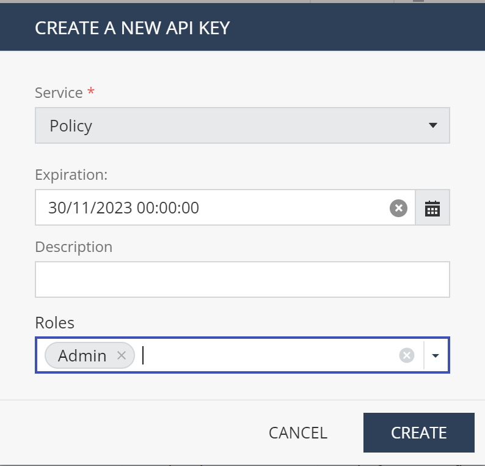
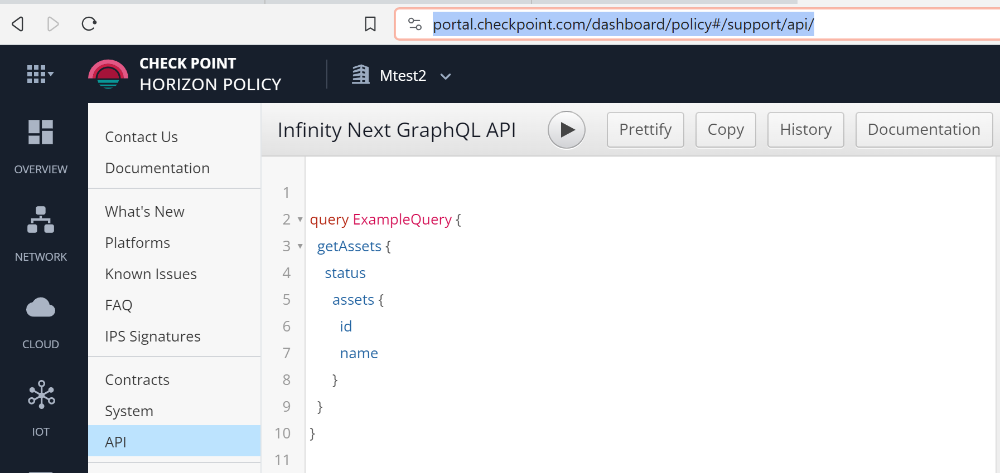
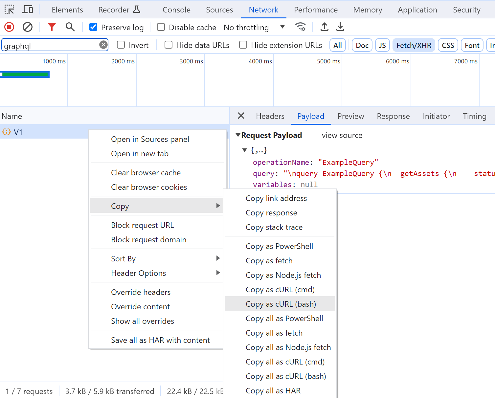

# GraphQL with CloudGuard AppSec

Will use `playground.http` to guide you through Horizion Policy (AppSec) API.

Obtain API key in Global Settings / API Keys: [https://portal.checkpoint.com/dashboard/settings/api-keys](https://portal.checkpoint.com/dashboard/settings/api-keys)



We depend on Horizon Policy API key from your tenant. Placed to .env in this folder, similar to:
```bash
APPSEC_API_KEY=19ce-use-your-own-56ff
APPSEC_API_KEY_SECRET=6a90-use-your-own-cf48
```






## More references - sample use of GraphQL API with CloudGuard AppSec

* publish AppSec policy from *Terraform* without external CLI tool:
https://github.com/mkol5222/appsec-publish-tf/blob/main/publish.tf#L4C1-L18C2

* create assets and publish&enforce in Killercoda playground using *bash* (curl and jq)
https://github.com/mkol5222/killerkoda-scenarios/blob/main/zz_appsec-training-embedded-profile/assets/appsec-setup-for-appurl.sh


